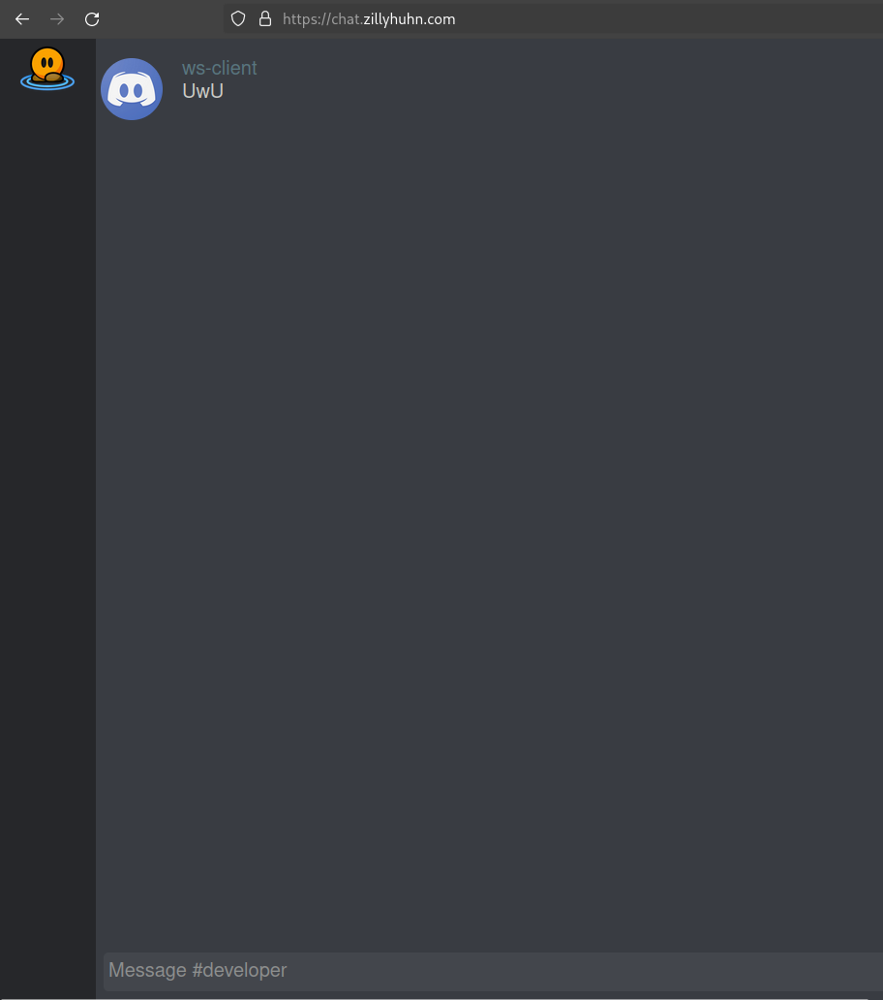

# discord-irc

**THIS IS A TOY PROJECT !!!**

**IT IS NOT BATTLE TESTED OR SECURITY AUDITED !!!**

Discord themed irc web Front-end for irc.
Uses [irc-websockets](https://github.com/ChillerDragon/irc-websockets) as backend.
Which is a websocket wrapper around a single irc client.
This Front-end then does use the backend to send and receive messages.
And replaces image links with actual image tags. And syntax highlights code snippets.


Its is still all irc under the hood. So there is no editing messages.
There is no multi line message support.

## setup

```
cp env.example .env
vim .env

npm install
npm run start
```

# try it your self

Chat in ddnet#developer via https://chat.zillyhuhn.com/


